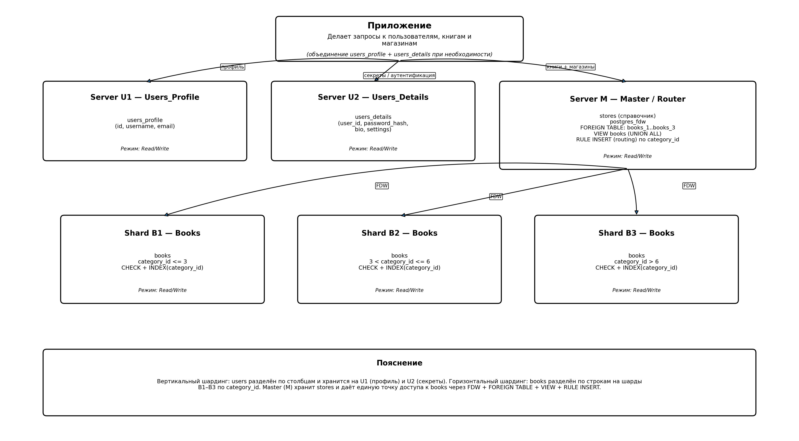

# Домашнее задание к занятию "`Репликация и масштабирование. Часть 2`" - `Oleg Avvakumov`

### Задание 1

`Опишите основные преимущества использования масштабирования методами:
активный master-сервер и пассивный репликационный slave-сервер;
master-сервер и несколько slave-серверов;
Дайте ответ в свободной форме.`

### Ответ

'1) Активный master и пассивный репликационный slave

Отказоустойчивость (страховка на случай падения мастера).
Если мастер выходит из строя, у нас уже есть актуальная копия данных на slave, и его можно поднять как новый основной сервер. Это ровно тот “паттерн применения”, который упоминается в материалах: много копий данных → проще пережить отказ.     Разгрузка мастера от части задач (особенно чтения). Мастер можно держать “для записи и критичных операций”, а на slave отправлять чтение, отчёты, аналитику, тяжёлые SELECT’ы — чтобы они не мешали транзакциям записи на мастере. По сути это даёт более стабильную работу при росте нагрузки.

Бэкапы удобнее делать со slave.
Снимать дампы/резервные копии с реплики обычно менее болезненно: мастер меньше проседает по производительности, потому что его не нагружаем “сервисными” операциями.

Упрощение обслуживания.
На slave можно тестировать часть изменений (например, настройки чтения, мониторинг), проводить плановые работы, не трогая мастер напрямую.

2) Master и несколько slave-серверов

Масштабирование чтения почти “в ширину”.
Если запросов на чтение становится много (витрина, каталог, отчёты, API), то несколько slave позволяют распределить read-нагрузку между ними. Это логично продолжает идею горизонтального масштабирования: добавили узлы → выросла суммарная пропускная способность. 

Разделение ролей между репликами.
Можно выделить:

один slave — под отчёты/аналитику (тяжёлые запросы),

второй — под бэкапы,

третий — под чтение приложения.
Так мы уменьшаем влияние “тяжёлых” задач на пользовательские запросы.

Больше вариантов для отказоустойчивости.
Когда реплик несколько, при проблемах с одной репликой сервис всё равно продолжает работать на остальных (хотя мастер остаётся единой точкой записи). А если проблема у мастера — есть выбор, кого поднимать как нового мастера. Смысл всё тот же: много копий данных повышает живучесть системы. 

География и восстановление после аварий.
Реплики можно держать в разных зонах/машинах (даже в другом ДЦ), чтобы проще переживать проблемы уровня “упал хост/сеть/площадка”. Это практическое развитие идеи “копий данных” для устойчивости. 

 Если система небольшая и основная цель — подстраховаться на случай падения мастера, то чаще всего хватает схемы master + 1 пассивный slave: она простая, даёт копию данных и позволяет относительно быстро восстановиться, а также удобно переносить на реплику бэкапы и тяжёлые чтения. 
 А когда проект растёт и появляется много запросов на чтение (витрины, API, отчёты), тогда логично переходить на master + несколько slave: так чтение можно распределить по репликам, выделить отдельные узлы под аналитику/бэкапы и в целом повысить устойчивость к сбоям отдельных реплик, сохранив мастера как единую точку записи.

'

---

### Задание 2
'Разработайте план для выполнения горизонтального и вертикального шаринга базы данных. База данных состоит из трёх таблиц:

пользователи,
книги,
магазины (столбцы произвольно).

Опишите принципы построения системы и их разграничение или разбивку между базами данных.

Пришлите блоксхему, где и что будет располагаться. Опишите, в каких режимах будут работать сервера.'

### Ответ

`
1) Что мы делаем и зачем

У нас 3 таблицы: пользователи, книги, магазины.
Нужно показать два вида шардинга:
Вертикальный шардинг — когда таблицу делим по столбцам и разносим по разным серверам (таблица становится “уже”, но строк столько же).
Горизонтальный шардинг — когда таблицу делим по строкам (структура одинаковая, но на каждом сервере только часть записей).
Шардинг — это именно физическое разнесение по разным серверам (не просто “логическое” деление)

2) Как именно делим таблицы (разграничение по базам)

А) Вертикальный шардинг для таблицы пользователи
Логика такая: часто нужны “лёгкие” поля (имя, email), а “тяжёлые/секретные” (пароль/настройки) — отдельно.
Делим “users” на две таблицы и кладём на разные сервера:
Server U1 / DB Users_Profile
users_profile(id, username, email) — то, что часто читается.
Server U2 / DB Users_Details
users_details(user_id, password_hash, bio, settings) — секреты и редко используемое.

Б) Горизонтальный шардинг для таблицы книги

Таблица books большая, поэтому делим по строкам по ключу шардинга category_id (как в примере из лекции).
Делаем 3 шарда (диапазоны категорий):
Shard B1: category_id <= 3
Shard B2: 3 < category_id <= 6
Shard B3: category_id > 6

На каждом шарде:
обычная таблица books
ограничение CHECK, чтобы не записать “чужой диапазон”
индекс по category_id для ускорения поиска

В) Таблица магазины
Я оставляю stores централизованной на master (как справочник). Она обычно небольшая и нужна всем, поэтому её шардинг не даёт заметного профита.

3) Как приложение будет ходить в “книги”, чтобы всё выглядело как одна таблица

Чтобы приложению не думать “в какой шард идти”, делаем Master/Router для books:
На Server M (master):
включаем postgres_fdw (чтобы мастер мог обращаться к таблицам на других серверах “как к своим”)
создаём foreign tables books_1, books_2, books_3 (прокси к шардам)
собираем единое представление VIEW books = books_1 UNION ALL books_2 UNION ALL books_3
делаем правила маршрутизации INSERT: по category_id запись улетает в нужный шард (books_1/2/3)
Итог: приложение просто работает с books на мастере, а распределение по шардам происходит автоматически.

4) В каких режимах работают сервера (read/write)

Минимально (без реплик):
U1 (Users_Profile) — Read/Write (создание/изменение профиля, чтение списков).
U2 (Users_Details) — Read/Write (аутентификация, смена пароля/настроек).
M (Master/Router + stores) — Read/Write (view/rules/FDW и таблица stores).
B1/B2/B3 (шарды books) — Read/Write каждый в своём диапазоне.
Если нужна отказоустойчивость/разгрузка чтения — добавляем реплики:
Реплика (standby) для каждого важного сервера: Read-Only.
Репликация полезна тем, что есть копии и при падении основного сервера можно переключиться на другой, но минус — возможны задержки/рассинхронизация.

5) Пошаговый план выполнения (коротко)

Спроектировать столбцы (произвольно) и ключи:
users_profile.id и users_details.user_id, books.category_id как ключ шардинга.
Поднять сервера/контейнеры: M, U1, U2, B1, B2, B3.
На U1 создать users_profile, на U2 создать users_details.
На B1/B2/B3 создать books + CHECK на диапазон + индекс по category_id.
На M включить postgres_fdw, завести foreign tables, сделать VIEW books, добавить RULE INSERT по category_id.
Проверить тестовыми вставками, что записи уходят в правильные шарды (B1/B2/B3).

`

---

